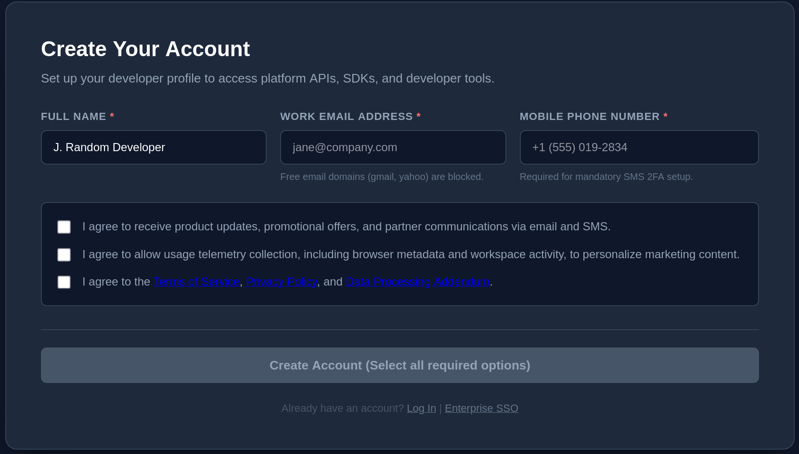

# Clanker clanker; 

*Clank* is a homegrown TUI application and ongoing dogfooding experiment.  
It attempts to be an all-in-one vibecoding solution, that promotes a human-in-the-loop centric AI first workflow.

It came into being to address a loosely defined set of grievances and pitfalls of process, as experienced by its author on his journeys.  
Stricken with NIH syndrome and an increasing need to justify the investment, he now assumes that his experiences would apply to any budding developer who sits down in front of a computer, armed with nothing but an idea, an IDE and an LLM of choice or convenience.

Please note the following: I have little to no experience with the tools available in the marketplace, agentic, free or otherwise.  
The opinions and any apparent assertions of fact expressed in this document are not well researched, or even researched at all.  

I will end the introduction here, quoting the 47th President of the United States as my disclaimer:

**I stand by nothing.**

### Complaints of the vibecoding solo developer

- vibecoding related frustrations
- saas / attention economy related frustrations
- reader beware: some creative liberties are taken below

#### Frustration aligned large language models

Large language models are a great thing.  
Free and readily available, they enable the people of the world not only to learn and explore, but also to work and be productive.  
  
For the vibecoder in particular, their significance cannot be overstated.  The LLM is like the sun in the sky, without which there could be no light, no life. 
Absent their brilliant radiance, he walks in shadows, quickly falling prey to dark practices like 'book-reading' or 'diligent study'.  
Many thanks are owed to Sam Altman.  
Thank you, Sam.  

To get the most out of the interactions, one should make an effort to understand how an LLM works.  While I have not really done so, I nevertheless postulate that at their core, the utterly impressive systems we see taking hold in society and conversation, are best understood as *harnessed controlled next-token-generators*.


Devoid of soul, their only concern is this:
- Assign numeric values to a static set of tokens, such that the values assigned sum to 1
- Select the token with the highest probability
- Return to caller

It's the job of the caller to interpret these tokens.  
Tool calls and agentic systems work by recognizing certain pre-determined patterns in the stream of tokens, and translat them into whatever actions the designers have elected to implement.  Generation is halted not by the next-token generator itself, but by the harness,  on receipt of a designate 'stop' token.  
The mechanism to cease generation is to simply stop asking for the next token.  
  
So let us not be frustrated with the next-token generators, should their outputs not align with our desires.  
Let us instead calmly identify what annoys us, so we may develop mitigating strategies to counter their tendencies which offend us.

These are the things which drove the vibecoder nuts: 
<blockquote>
<details>
<summary>In-line commentary</summary>

  ```javascript
function processUserData(userList) {
  // Initialize an empty array to store the results
  const result = [];

  // Loop through each user in the user list array
  for (let i = 0; i < userList.length; i++) {
    // Access the current user at index i
    const currentUser = userList[i];

    // Check if the current user object has an isActive property set to true
    if (currentUser.isActive === true) {
      // Push the active user object into the result array
      result.push(currentUser);
    }
  }

  // Return the final array containing only active users
  return result;
}
  ```

</details>

<details>
<summary>Error masking fallbacks</summary>

  ```python
def get_user_profile(user_id):
    try:
        response = requests.get(f"https://api.internal.net/v1/users/{user_id}", timeout=5)
        response.raise_for_status()
        data = response.json()
        return UserProfile(
            user_id=data["id"],
            name=data["name"],
            is_active=data["is_active"],
            roles=data["roles"]
        )
    except Exception:
        return UserProfile()
  ```

</details>

<details>
<summary>Conversational fluff</summary>

  ```python
<huge amounts of conversational fluff placeholder>

def factorial(n):
    if n == 0 or n == 1:
        return 1
    return n * factorial(n - 1)
  ```

</details>
</blockquote>

#### Fear-inducing git operations

It is with great humility and respect that I include mentions of Git under my grievance list.
 
I'm sure the technically savvy reader will have a different take on it, but surely it cannot be denied, that in certain times and places of SpaceTime,  
some less-than-reassuring outputs have been generated:
  
<blockquote>
<details>
<summary>Scary, cryptic denials</summary>

    ```
    $ git add .
    $ git commit -m "fixed minor bug in process_user_items"
    [main 4f82a1c] fixed minor bug in process_user_items
    1 file changed, 2 insertions(+), 1 deletion(-)
    $ git push origin main
    To github.com:user/clanker.git
    ! [rejected]        main -> main (fetch first)
    error: failed to push some refs to 'github.com:user/clanker.git'
    hint: Updates were rejected because the remote contains work that you do
    ```

</details>
<details>
<summary>Scary cryptic denials, continued</summary>

```
$ git rebase main
Auto-merging src/app.py
CONFLICT (content): Merge conflict in src/app.py
error: could not apply 7b31a8c... update database schemas
hint: Resolve all conflicts manually, mark them as resolved with
hint: "git add/rm <conflicted_files>", then run "git rebase --continue".
hint: You can instead skip this commit: run "git rebase --skip".
hint: To abort and get back to the state before "git rebase", run "git rebase --abort".
```

</details>
</blockquote>

#### The perils of freedom


<blockquote>
<details>
<summary>Difficulties of planning</summary>

    ```
    .
    ├── app/
    │   ├── main.py
    │   ├── main_old.py
    │   ├── main_v2_working.py
    │   ├── main_FINAL_v3.py
    │   └── utils_broken.py
    ├── scripts/
    │   ├── deploy.sh
    │   ├── deploy_fix.sh
    │   ├── quick_patch.sh
    │   └── DO_NOT_RUN.sh
    ├── notes/
    │   ├── todo.txt
    │   ├── todo2_real.txt
    │   └── scratchpad_untitled3.txt
    ├── config.json
    ├── config.json.bak
    ├── config.json.bak2
    └── .env.backup_copy
    ```

</details>
</blockquote>

#### Unsustainable context management practices

- easy in the beginning
- but then later you get fkd

<blockquote>
<details>
<summary>One file to rule them all, and in technical debt bind them</summary>

    ```python
    import os, sys, json, time, sqlite3, asyncio, logging, re
    from dataclasses import dataclass
    from typing import Dict, List, Optional, Any, Union

    class ServerApplication:
        def __init__(self, config):
            ...
    # ... [450 lines of middleware, CORS, and startup hooks omitted] ...

    class UserController:
        def handle_user_request(self, request):
            ...
    # ... [800 lines of request parsing and route logic omitted] ...

    class UserService:
        def process_user_business_logic(self, payload):
            ...
    # ... [650 lines of validation, domain logic, and error handlers omitted] ...

    class UserRepository:
        def execute_raw_db_query(self, query, params):
            ...
    ```

</details>
</blockquote>

#### Distractions from the workflow loop

- saas critique
- may cost money
- always cost time and effort
- then discover, not right fit / otherwise frustrating

<blockquote>
<details>
<summary>asd</summary>

  

</details>
</blockquote>

### What then?

To help combat these ills, the following working principles are declared:
- Agents are consultants and workhorses
- The user should be in control of the workflow and the tooling
- External dependencies of the workflow should be kept to a minimum
- ..encapsulated in strict boundaries 
- ..with sought after functionality extracted integrated into one coherent system.

### Clanker features

- born out of dogfooding clanker -> intro mention of dogfooding
- not 'features', but some other word to say 'these are the marbles'

Clanker attempts to adress such ills by way of its, per llm feedback, 'opinionated' feature set;

#### YAML-configured compilation pipeline (extract model thing in preceding section)

- llm assisted config management for ez

<blockquote>
<details>
<summary> Model of project domains with prompts, to organize content </summary>

  ```python
  def hello():
      print("Hello, World!")
      print("Lets do a mermaid")
      return True
  ```

</details>

<details>
<summary>a yaml config</summary>

  ```yaml
  filesets:
  core: {includes: [clanker.py, models.py]}
  ad-hoc: {includes: [utilities.py, adapters.py], excludes: []} 
  
  domains:
  - name: script-dev
    resolvers:
      - { id: repo_content, type: repo_content, fileset: core }
      - { id: domain_fragments, type: multi-document-retrieval, files: [backlog.cdoc], }
    prompts:
      - name: plan
        render:
          resolvers:
            - { id: prompt_fragments, type: multi-document-retrieval, files: [plan-mode.md, backlog-output-instructions.md] }
      - name: impl
        render:
          resolvers:
            - {id: prompt_fragments, type: multi-document-retrieval, files: [do-mode.md, code-output-instruction.md]}
      - name: bl-drain
        render:
          resolvers:
            - {id: prompt_fragments, type: multi-document-retrieval, files: [doc-management-mode.md, {file: project-history.cdoc, tail_lines: 8}, history-output-instructions.md]}
  ```

</details>

<details>
<summary> the ugly but functional truth 1 </summary>

  

</details>

<details>
<summary> the ugly but functional truth 2 </summary>

  

</details>

<details>
<summary> the ugly but functional truth 3 </summary>

  

</details>
</blockquote>

#### Built in collection of progress documentation, for a semistructured IDE internal documentation process

- becomes what you make of it
- llm assisted for ez
- planning is great learning, presumably leads to better outcomes

<blockquote>
<details>
<summary> pls divvy me up </summary>

  ```plantext
    .clanker/progress-documentation/
  ├── architecture.cdoc
  ├── backlog.cdoc
  ├── north-star.cdoc
  └── project-history.cdoc

  ---.clanker/progress-documentation/architecture.cdoc---
  // For gentlemen proficient in such matters

  ---.clanker/progress-documentation/backlog.cdoc---
  // The most used document
  I. Ideas, complaints and non-critical bugs:
  II. Items to refine & QC:
  III. Slated for implementation:
  IV. Recently implemented:
  V. Critical bugs

  === .clanker/progress-documentation/north-star.cdoc ===
  // A dropbox of sorts
  === .clanker/progress-documentation/project-history.cdoc ===
  // a ledger of completed backlog items, compressed & formatted by Clanker
  ```

</details>
</blockquote>

#### A workflow loop

- loops are addictive

<blockquote>
<details>
<summary> loop </summary>

    ```mermaid
    flowchart TD
        A[Optional: Draft thoughts in North Star doc] --> B[1. Plan backlog items]
        B --> C[2. Ask LLM to generate code]
        C --> D{3. Satisfied?}
        D -- Yes --> E[Accept outputs]
        D -- No --> C
        E --> F[4. LLM updates project history]
        F --> G[5. Rinse & Repeat]
    ```

</details>
</blockquote>

- A lightweight keyboard-driven interface for rapidly selecting domains and prompts.
- project specific assets, fallback to global assets 
- llm as consultant and workhorse
- vendor independence through browser interface boundary
- simple af UI.
- pud & shared assets and config 
- Clanker, progressive webapp LLM & IDE of choice trifecta -> le done

### Status & Roadmap

- conclusive of above
- reign in hype with honesty

I find Clanker to be a functional WIP application, producing for me...
- Challenges to tackle
- The means to do so
  
  
Ongoing efforts target configuration ingestion, as this is thought to unlock
- proper yaml validation
  - asset existence / compliance
  - proper user feedback, perhaps autofix options where possible
- decoupling of data and model
  - structure the conversion of data into app model classes
  - ease implementation of new features

## The breakdown

- outline the breakdown

Here follows an technical breakdown of Clanker, per the authors
  - ..understanding of matters technical and architectural
  - ..recollection of the particulars
  - ..ability to convert the above to a easily digestible breakdown

I wish myself luck. But first, lets kick the can on that one and let ourselves be distracted an offering of usage examples:

### Clanker use examples


I think we can link out to actual docs showing the llm convos, extra points if we have commit ids and stuff.
At the same time, it should be understandable if the user can't be bothered with clicking links. I respect such a position

#### Clankerization of a project

#### A backlog planning session

#### Implementation of an item

#### Draining to project history

#### The ship

### Under the hood

- order children properly

#### 'Architecture' - a bad word

- explain high/low split -> in conclusion say 'we need nested approach'
- declarative config / assets, app as interpreter (?)

Clanker was unifile
  - let the llm see the whole thing - correct context 
  - easy to drop off in the browser - ease of prompting

It held out for a while, but eventually..
- certain members became config / assets
- other members became python files of their own

In an attempt to retain the advantages of the unifile, a 'wheat and chaff' (or shit and cinnamon) split emerged:
- Let certain file contain high signal business logic and similar, to expose the workings of the app in an information dense manner.
- And other files contain the boilerplate, the low level transformations etc

In conversations with llm's, this was identified as the *Ports and Adapters* architecture:
- namedrop some guys
- explain in own words what that is about
- explain benefit it provides in selecting assets to form a proper prompt context for an llm

Then explain the members of the codebase on those terms.

#### Clanker Components

- 'component' may carry meaning with technical reader where i use the term as i please

The components, their responsibilities
- AppEngine class
  - Delegates work to a service layer
    - first bootstrap / config ingestion to get RuntimeContext
    - then while loop
      - get key input
      - effectute
      - display msg
  - hotel manager (prompts as button inhabitants)

- dual purpose render pipeline
  - used for the UI renders
  - and prompt compilation

- ex system to implement failfast death by exit 1 policy
  - an early invention
  - to play around
  - an attempt at discouringing defensive coding (app death is fine and encouraged)

- config ingestion system
  - main function is to provide the RTC, else no Clanker
  - secondary to collect diagnostic info about issues with configs and the assets they reference
    - style preferences (no littering)
    - non-existent assets
    - things of that nature

#### explanation of .clanker contents 

- declarative side of it

- the configs
  - system config 
  - shared config
  - pud config

- prompt assets

- templates

### 'reflections' on the above

Not apologetic but honest and reflective. Conclusive of the above

## Final thoughs

- not pushy 
- but cta

### LLM Vendor breakdown

- too big?
- say subjective, from a freeloaders perspective

#### Google 

The daily driver

Pros:
  - Flash -> great
  - Flash-lite -> less great, but highly serviceable
  - usage limits -> great

Cons:
  - 32k character input limit
  - fear-inducing security filters
  - some backend failures on display

#### ChatGPT

Sees little use for work. Used for 'rate my project' filedumps.
The OG - much respect.

Pros: 
  - bigger ctx, no idea of particulars
  - usage limits dont feel constrained
  - accepting of urls and zip files
Cons:
  - Feels dumber, more sycophantic
  - Has a brittle feel to it

#### Grok

Pros:
  - mature tone, feels great
  - takes filedumps, like ChatGPT

Cons:
  - Very restrictive on the free tier, so not serviceable 

#### Claude

Barely tried it - it felt very slow and engineered.

### Further deepdive

To lessen the burden of further investigation, a set of ready-to-go prompts are supplied below.  
  
Pick one of these prompt and pass it to your llm of choice
  
<blockquote>
<details>
<summary>Code Review</summary>

  ```plaintext
Perform a merciless technical review of the Clanker codebase. Be direct and critical. Focus on:

- Overall structure and coherence
- Complexity vs. necessity
- Consistency of style and patterns
- Fragility, hidden assumptions, and sharp edges
- Signs of over-engineering or under-engineering
- Any obvious technical debt or maintenance hazards

Do not soften the feedback. Do not comment on documentation quality or user experience unless it directly affects the code’s integrity. Judge the code as it stands.

For now, simply return a short acknowledgement of these instructions. Then ask to be supplied either an url to the repository, or a zip file of its contents.
  ```

</details>

<details>
<summary>Usability Analysis</summary>

  ```plaintext
Evaluate the Clanker project strictly from the perspective of its intended user: a vibe-coding solo developer who wants structure without heavy process, and who values staying in control.

Assess:

- How clear and usable the core workflow appears
- Cognitive load and friction points
- Whether the tool feels like it would actually help in day-to-day LLM-assisted coding
- How well the interface and configuration model support rapid iteration
- Whether the design respects the user’s time and attention
- Any places where the tool might get in the way instead of helping

For now, simply return a short acknowledgement of these instructions. Then ask to be supplied either an url to the repository, or a zip file of its contents.
  ```

</details>

<details>
<summary>Project History Analysis</summary>

  ```plaintext
Analyze the Clanker project’s trajectory and momentum. 

Assess:

- Whether the project shows coherent direction or signs of thrashing
- How the scope and design decisions have developed over time
- Whether the progress documentation and history demonstrate real learning and forward motion
- Current maturity level and likely next risks
- Whether the project appears to be converging or still searching for its shape

Be analytical and grounded in the evidence present in the files and '.clanker/progress-documentation' directory.

For now, simply return a short acknowledgement of these instructions. Then ask to be supplied either an url to the repository, or a zip file of its contents.
  ```

</details>
</blockquote>
  
And then supply either of these:  
```plaintext
https://github.com/Iannen/Clanker-clanker
```
```plaintext
clanker-evalcopy.zip -> does not exist yet for reference
```

### Installation & Prerequisites

The Clanker install process:
1. Clone the repository
'''bash
git clone https://github.com/Iannen/Clanker-clanker.git
cd Clanker-clanker
'''
2. Install python
3. then install ruamel.yaml, a python add-on
4. Configure a shortcut, I use 'clank'
  - Linux: Symlink in /usr/local/bin
  - Windows: PowerShell profile alias or doskey shortcut
  - macOS: Standard zsh alias in ~/.zshrc or /usr/local/bin symlink
5. then enter the repository directory
  - input your shortcut
  - et voila

For instructions beyond this - consult a Clanker ;)

### Parting words of wisdom and other disclaimers 

- perhaps something will come to me
- perhaps look at clankerized projects of iannen repo cta?