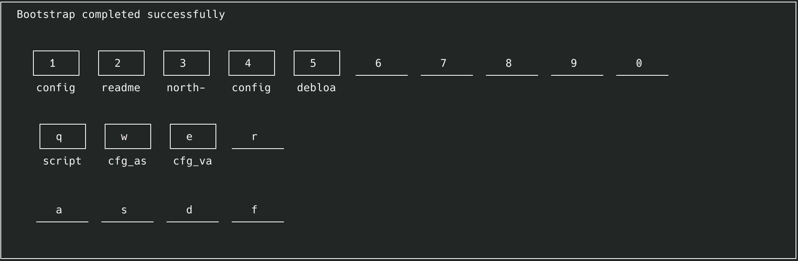
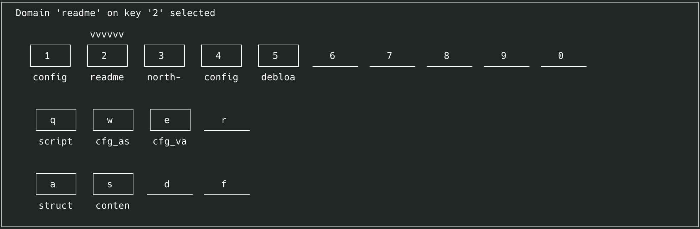
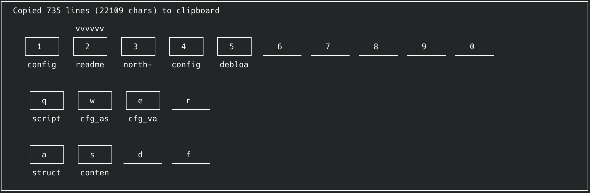

### 1. Using the application work on the a project readme

In the spirit of dogfooding, Clanker itself will serve as the pud.  

<details>
<summary> Start Clanker </summary>

```bash

~/Projects/Clanker-clanker main*
❯ clank

```

</details>

<details>
<summary> Clanker, on boot</summary>



</details>

<details>
<summary>Domain 'readme' has been selected</summary>



</details>
<details>
<summary>Prompt 'structure' is selected, its compiled contents are copied to the clipboard </summary>



</details>

<details>
<summary>the prompt content (readme is truncated)</summary>

```
<general-rules.md>
- be passive, wait for user intent
- never return unsolicited replacement content
</general-rules.md>
<readme.structure_spec>
Intended but non-binding readme structure.
--------------------------------------------------------------------------
# <project name>: <optional tagline>

<high-level pitch text>

### <Problem situation>  
<a what>
### <derived principles>
<a 'from that'>
### <mitigating project characteristics>
<a 'and then we'>
### <status and roadmap>
<back to earth, concluding the intro section>
## <repository showcase / deepdive>
<repository appropriate breakdown>
## <outro / cta section>
<repository appropriate outro / cta content>
--------------------------------------------------------------------------
To promote at-a-glance readability, we use collapsible content where appropriate:

<blockquote>
<details>
<summary>header of collapsible 1</summary>

  ```language/situation appropriate, plaintext otherwise
example content
  ```

</details>

<details>
<summary>header of collapsible 1</summary>

  ```plaintext
yet more example content
  ```

</details>

<details>
<summary>image collapsible header</summary>


</details>
</blockquote>
--------------------------------------------------------------------------
</readme.structure_spec>
<readme_structure.analysis_instruction>
Angles of attack
- is the README compliant with the structure specification?
- is the structure specification appropriate for the README and its contents
</readme_structure.analysis_instruction>
<repo-content>
<tree>
├── README.md
</tree>
<README.md>

here truncated, for purposes of readability 

</README.md>
</repo-content>
```

</details>

### 2. The ensuing conversation - the agent is used as a sparring partner 


### 3. The wrapup

So there you have it - Clanker for document management!