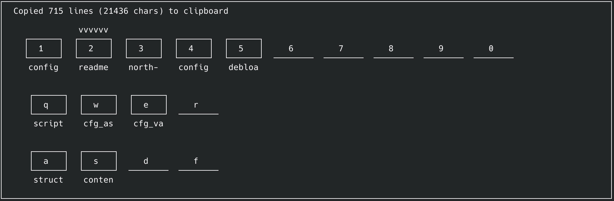

### 1. Using the application work on the a project readme

In the spirit of dogfooding, Clanker itself will serve as the pud.  

<details>
<summary> Start Clanker </summary>

```bash

~/Projects/Clanker-clanker main*
❯ clank

```

</details>

<details>
<summary> Clanker, on boot</summary>


</details>

<details>
<summary>Domain 'readme' has been selected</summary>


</details>
<details>
<summary>Prompt 'content' is selected, and its compiled contents are copied to the clipboard </summary>



</details>

<details>
<summary>the prompt content (readme is truncated)</summary>

```
<general-rules.md>
- be passive, wait for user intent
- never return unsolicited replacement content
</general-rules.md>
<readme_messaging.intent>
Clanker highlights 
- all in one tool
-- Built-in, flexible progress documentation system
-- reusable shared assets
-- project specific assets
-- development loop based
- dogfooding
-- that works
-- per author experience  
- config driven
- opposes vendor lock in / integration
    - Leverage free resources
    - Bail if they get froggy
-repository delivered
--the user becomes the developer

project audience
- vibe coders
    - Want structure
    - Automate repeated work
- DIY tooling enthusiast
    - to sample

readme style
- technical content
-- only where required
-- Favour readability for all
-honest, grounded in reality
--hype and flair is allowd
--but must resolve appropriately

call to action intent
- inspect code & assets:
- try it out:

</readme_messaging.intent>
<readme_content.analysis_instruction>
evaluate if the readme expresses the intent of the docspec file
</readme_content.analysis_instruction>
<repo-content>
<tree>
├── README.md
</tree>
<README.md>

here truncated, for purposes of readability 

</README.md>
</repo-content>
```

</details>

### 2. The ensuing conversation - the agent is used as a sparring partner 

<details>
<summary>Compiled initial prompt</summary>

\<general-rules.md\> \- be passive, wait for user intent \- never return unsolicited replacement content \</general-rules.md\> \<readme\_messaging.intent\> Clanker highlights  \- all in one tool \-- Built-in, flexible progress documentation system \-- reusable shared assets \-- project specific assets \-- development loop based \- dogfooding \-- that works \-- per author experience   \- config driven \- opposes vendor lock in / integration     \- Leverage free resources     \- Bail if they get froggy \-repository delivered \--the user becomes the developer project audience \- vibe coders     \- Want structure     \- Automate repeated work \- DIY tooling enthusiast     \- to sample readme style \- technical content \-- only where required \-- Favour readability for all \-honest, grounded in reality \--hype and flair is allowd \--but must resolve appropriately call to action intent \- inspect code & assets: \- try it out: \</readme\_messaging.intent\> \<readme\_content.analysis\_instruction\> evaluate if the readme expresses the intent of the docspec file \</readme\_content.analysis\_instruction\> \<repo-content\> \<tree\> ├── README.md \</tree\> \<README.md\> \# Clanker clanker;  \*Clank\* is a homegrown TUI application and ongoing dogfooding experiment.   It attempts to be an all-in-one vibecoding solution, that promotes a human-in-the-loop centric AI first workflow. It came into being to address a loosely defined set of grievances and pitfalls of process, as experienced by its author on his journeys.   Stricken with NIH syndrome and an increasing need to justify the investment, he now assumes that his experiences would apply to any budding developer who sits down in front of a computer, armed with nothing but an idea, an IDE and an LLM of choice or convenience. Please note the following: I have little to no experience with the tools available in the marketplace, agentic, free or otherwise.   The opinions and any apparent assertions of fact expressed in this document are not well researched, or even researched at all.   I will end the introduction here, quoting the 47th President of the United States as my disclaimer: \*\*I stand by nothing.\*\* \#\#\# Complaints of the vibecoding solo developer \- vibecoding related frustrations \- saas / attention economy related frustrations \- reader beware: some creative liberties are taken below \#\#\#\# Frustration aligned large language models Large language models are a great thing.   Free and readily available, they enable the people of the world not only to learn and explore, but also to work and be productive.	  For the vibecoder in particular, their significance cannot be overstated.  The LLM is like the sun in the sky, without which there could be no light, no life.  Absent their brilliant radiance, he walks in shadows, quickly falling prey to dark practices like 'book-reading' or 'diligent study'.   Many thanks are owed to Sam Altman.   Thank you, Sam.   To get the most out of the interactions, one should make an effort to understand how an LLM works.  While I have not really done so, I nevertheless postulate that at their core, the utterly impressive systems we see taking hold in society and conversation, are best understood as \*harnessed controlled next-token-generators\*. Devoid of soul, their only concern is this: \- Assign numeric values to a static set of tokens, such that the values assigned sum to 1 \- Select the token with the highest probability \- Return to caller It's the job of the caller to interpret these tokens.   Tool calls and agentic systems work by recognizing certain pre-determined patterns in the stream of tokens, and translat them into whatever actions the designers have elected to implement.  Generation is halted not by the next-token generator itself, but by the harness,  on receipt of a designate 'stop' token.   The mechanism to cease generation is to simply stop asking for the next token.	  So let us not be frustrated with the next-token generators, should their outputs not align with our desires.   Let us instead calmly identify what annoys us, so we may develop mitigating strategies to counter their tendencies which offend us. These are the things which drove the vibecoder nuts:  \<blockquote\> \<details\> \<summary\>In-line commentary\</summary\>   \`\`\`javascript function processUserData(userList) {   // Initialize an empty array to store the results   const result \= \[\];   // Loop through each user in the user list array   for (let i \= 0; i \< userList.length; i++) {     // Access the current user at index i     const currentUser \= userList\[i\];     // Check if the current user object has an isActive property set to true     if (currentUser.isActive \=== true) {       // Push the active user object into the result array       result.push(currentUser);     }   }   // Return the final array containing only active users   return result; }   \`\`\` \</details\> \<details\> \<summary\>Error masking fallbacks\</summary\>   \`\`\`python def get\_user\_profile(user\_id):     try:         response \= requests.get(f"https://api.internal.net/v1/users/{user\_id}", timeout=5)         response.raise\_for\_status()         data \= response.json()         return UserProfile(             user\_id=data\["id"\],             name=data\["name"\],             is\_active=data\["is\_active"\],             roles=data\["roles"\]         )     except Exception:         return UserProfile()   \`\`\` \</details\> \<details\> \<summary\>Conversational fluff\</summary\>   \`\`\`python \<huge amounts of conversational fluff placeholder\> def factorial(n):     if n \== 0 or n \== 1:         return 1     return n \* factorial(n \- 1\)   \`\`\` \</details\> \</blockquote\> \#\#\#\# Fear-inducing git operations It is with great humility and respect that I include mentions of Git under my grievance list.   I'm sure the technically savvy reader will have a different take on it, but surely it cannot be denied, that in certain times and places of SpaceTime,   some less-than-reassuring outputs have been generated:    \<blockquote\> \<details\> \<summary\>Scary, cryptic denials\</summary\>     \`\`\`     $ git add .     $ git commit \-m "fixed minor bug in process\_user\_items"     \[main 4f82a1c\] fixed minor bug in process\_user\_items     1 file changed, 2 insertions(+), 1 deletion(-)     $ git push origin main     To github.com:user/clanker.git     \! \[rejected\]        main \-\> main (fetch first)     error: failed to push some refs to 'github.com:user/clanker.git'     hint: Updates were rejected because the remote contains work that you do     \`\`\` \</details\> \<details\> \<summary\>Scary cryptic denials, continued\</summary\> \`\`\` $ git rebase main Auto-merging src/app.py CONFLICT (content): Merge conflict in src/app.py error: could not apply 7b31a8c... update database schemas hint: Resolve all conflicts manually, mark them as resolved with hint: "git add/rm \<conflicted\_files\>", then run "git rebase \--continue". hint: You can instead skip this commit: run "git rebase \--skip". hint: To abort and get back to the state before "git rebase", run "git rebase \--abort". \`\`\` \</details\> \</blockquote\> \#\#\#\# The perils of freedom \<blockquote\> \<details\> \<summary\>Difficulties of planning\</summary\>     \`\`\`     .     ├── app/     │   ├── main.py     │   ├── main\_old.py     │   ├── main\_v2\_working.py     │   ├── main\_FINAL\_v3.py     │   └── utils\_broken.py     ├── scripts/     │   ├── deploy.sh     │   ├── deploy\_fix.sh     │   ├── quick\_patch.sh     │   └── DO\_NOT\_RUN.sh     ├── notes/     │   ├── todo.txt     │   ├── todo2\_real.txt     │   └── scratchpad\_untitled3.txt     ├── config.json     ├── config.json.bak     ├── config.json.bak2     └── .env.backup\_copy     \`\`\` \</details\> \</blockquote\> \#\#\#\# Unsustainable context management practices \- easy in the beginning \- but then later you get fkd \<blockquote\> \<details\> \<summary\>One file to rule them all, and in technical debt bind them\</summary\>     \`\`\`python     import os, sys, json, time, sqlite3, asyncio, logging, re     from dataclasses import dataclass     from typing import Dict, List, Optional, Any, Union     class ServerApplication:         def \_\_init\_\_(self, config):             ...     \# ... \[450 lines of middleware, CORS, and startup hooks omitted\] ...     class UserController:         def handle\_user\_request(self, request):             ...     \# ... \[800 lines of request parsing and route logic omitted\] ...     class UserService:         def process\_user\_business\_logic(self, payload):             ...     \# ... \[650 lines of validation, domain logic, and error handlers omitted\] ...     class UserRepository:         def execute\_raw\_db\_query(self, query, params):             ...     \`\`\` \</details\> \</blockquote\> \#\#\#\# Distractions from the workflow loop \- saas critique \- may cost money \- always cost time and effort \- then discover, not right fit / otherwise frustrating \<blockquote\> \<details\> \<summary\>asd\</summary\>   \!\[SaaS Shaming Signup UI\](presentation/saas\_shaming.png) \</details\> \</blockquote\> \#\#\# What then? To help combat these ills, the following working principles are declared: \- Agents are consultants and workhorses \- The user should be in control of the workflow and the tooling \- External dependencies of the workflow should be kept to a minimum \- ..encapsulated in strict boundaries  \- ..with sought after functionality extracted integrated into one coherent system. \#\#\# Clanker features \- born out of dogfooding clanker \-\> intro mention of dogfooding \- not 'features', but some other word to say 'these are the marbles' Clanker attempts to adress such ills by way of its, per llm feedback, 'opinionated' feature set; \#\#\#\# YAML-configured compilation pipeline (extract model thing in preceding section) \- llm assisted config management for ez \<blockquote\> \<details\> \<summary\> Model of project domains with prompts, to organize content \</summary\>   \`\`\`python   def hello():       print("Hello, World\!")       print("Lets do a mermaid")       return True   \`\`\` \</details\> \<details\> \<summary\>a yaml config\</summary\>   \`\`\`yaml   filesets:   core: {includes: \[clanker.py, models.py\]}   ad-hoc: {includes: \[utilities.py, adapters.py\], excludes: \[\]}  	 domains:   \- name: script-dev     resolvers:       \- { id: repo\_content, type: repo\_content, fileset: core }       \- { id: domain\_fragments, type: multi-document-retrieval, files: \[backlog.cdoc\], }     prompts:       \- name: plan         render:           resolvers:             \- { id: prompt\_fragments, type: multi-document-retrieval, files: \[plan-mode.md, backlog-output-instructions.md\] }       \- name: impl         render:           resolvers:             \- {id: prompt\_fragments, type: multi-document-retrieval, files: \[do-mode.md, code-output-instruction.md\]}       \- name: bl-drain         render:           resolvers:             \- {id: prompt\_fragments, type: multi-document-retrieval, files: \[doc-management-mode.md, {file: project-history.cdoc, tail\_lines: 8}, history-output-instructions.md\]}   \`\`\` \</details\> \<details\> \<summary\> the ugly but functional truth 1 \</summary\>   \!\[UI on program start \](presentation/saas\_shaming.png) \</details\> \<details\> \<summary\> the ugly but functional truth 2 \</summary\>   \!\[UI after domain selection \](presentation/saas\_shaming.png) \</details\> \<details\> \<summary\> the ugly but functional truth 3 \</summary\>   \!\[UI after prompt selection\](presentation/saas\_shaming.png) \</details\> \</blockquote\> \#\#\#\# Built in collection of progress documentation, for a semistructured IDE internal documentation process \- becomes what you make of it \- llm assisted for ez \- planning is great learning, presumably leads to better outcomes \<blockquote\> \<details\> \<summary\> pls divvy me up \</summary\>   \`\`\`plantext     .clanker/progress-documentation/   ├── architecture.cdoc   ├── backlog.cdoc   ├── north-star.cdoc   └── project-history.cdoc   \---.clanker/progress-documentation/architecture.cdoc---   // For gentlemen proficient in such matters   \---.clanker/progress-documentation/backlog.cdoc---   // The most used document   I. Ideas, complaints and non-critical bugs:   II. Items to refine & QC:   III. Slated for implementation:   IV. Recently implemented:   V. Critical bugs   \=== .clanker/progress-documentation/north-star.cdoc \===   // A dropbox of sorts   \=== .clanker/progress-documentation/project-history.cdoc \===   // a ledger of completed backlog items, compressed & formatted by Clanker   \`\`\` \</details\> \</blockquote\> \#\#\#\# A workflow loop \- loops are addictive \<blockquote\> \<details\> \<summary\> loop \</summary\>     \`\`\`mermaid     flowchart TD         A\[Optional: Draft thoughts in North Star doc\] \--\> B\[1. Plan backlog items\]         B \--\> C\[2. Ask LLM to generate code\]         C \--\> D{3. Satisfied?}         D \-- Yes \--\> E\[Accept outputs\]         D \-- No \--\> C         E \--\> F\[4. LLM updates project history\]         F \--\> G\[5. Rinse & Repeat\]     \`\`\` \</details\> \</blockquote\> \- A lightweight keyboard-driven interface for rapidly selecting domains and prompts. \- project specific assets, fallback to global assets  \- llm as consultant and workhorse \- vendor independence through browser interface boundary \- simple af UI. \- pud & shared assets and config  \- Clanker, progressive webapp LLM & IDE of choice trifecta \-\> le done \#\#\# Status & Roadmap \- conclusive of above \- reign in hype with honesty I find Clanker to be a functional WIP application, producing for me... \- Challenges to tackle \- The means to do so 	  Ongoing efforts target configuration ingestion, as this is thought to unlock \- proper yaml validation   \- asset existence / compliance   \- proper user feedback, perhaps autofix options where possible \- decoupling of data and model   \- structure the conversion of data into app model classes   \- ease implementation of new features \#\# The breakdown \- outline the breakdown Here follows an technical breakdown of Clanker, per the authors   \- ..understanding of matters technical and architectural   \- ..recollection of the particulars   \- ..ability to convert the above to a easily digestible breakdown I wish myself luck. But first, lets kick the can on that one and let ourselves be distracted an offering of usage examples: \#\#\# Clanker use examples I think we can link out to actual docs showing the llm convos, extra points if we have commit ids and stuff. At the same time, it should be understandable if the user can't be bothered with clicking links. I respect such a position \#\#\#\# Clankerization of a project \#\#\#\# A backlog planning session \#\#\#\# Implementation of an item \#\#\#\# Draining to project history \#\#\#\# The ship \#\#\# Under the hood \- order children properly \#\#\#\# 'Architecture' \- a bad word \- explain high/low split \-\> in conclusion say 'we need nested approach' \- declarative config / assets, app as interpreter (?) Clanker was unifile   \- let the llm see the whole thing \- correct context    \- easy to drop off in the browser \- ease of prompting It held out for a while, but eventually.. \- certain members became config / assets \- other members became python files of their own In an attempt to retain the advantages of the unifile, a 'wheat and chaff' (or shit and cinnamon) split emerged: \- Let certain file contain high signal business logic and similar, to expose the workings of the app in an information dense manner. \- And other files contain the boilerplate, the low level transformations etc In conversations with llm's, this was identified as the \*Ports and Adapters\* architecture: \- namedrop some guys \- explain in own words what that is about \- explain benefit it provides in selecting assets to form a proper prompt context for an llm Then explain the members of the codebase on those terms. \#\#\#\# Clanker Components \- 'component' may carry meaning with technical reader where i use the term as i please The components, their responsibilities \- AppEngine class   \- Delegates work to a service layer     \- first bootstrap / config ingestion to get RuntimeContext     \- then while loop       \- get key input       \- effectute       \- display msg   \- hotel manager (prompts as button inhabitants) \- dual purpose render pipeline   \- used for the UI renders   \- and prompt compilation \- ex system to implement failfast death by exit 1 policy   \- an early invention   \- to play around   \- an attempt at discouringing defensive coding (app death is fine and encouraged) \- config ingestion system   \- main function is to provide the RTC, else no Clanker   \- secondary to collect diagnostic info about issues with configs and the assets they reference     \- style preferences (no littering)     \- non-existent assets     \- things of that nature \#\#\#\# explanation of .clanker contents  \- declarative side of it \- the configs   \- system config    \- shared config   \- pud config \- prompt assets \- templates \#\#\# 'reflections' on the above Not apologetic but honest and reflective. Conclusive of the above \#\# Final thoughs \- not pushy  \- but cta \#\#\# LLM Vendor breakdown \- too big? \- say subjective, from a freeloaders perspective \#\#\#\# Google  The daily driver Pros:   \- Flash \-\> great   \- Flash-lite \-\> less great, but highly serviceable   \- usage limits \-\> great Cons:   \- 32k character input limit   \- fear-inducing security filters   \- some backend failures on display \#\#\#\# ChatGPT Sees little use for work. Used for 'rate my project' filedumps. The OG \- much respect. Pros:    \- bigger ctx, no idea of particulars   \- usage limits dont feel constrained   \- accepting of urls and zip files Cons:   \- Feels dumber, more sycophantic   \- Has a brittle feel to it \#\#\#\# Grok Pros:   \- mature tone, feels great   \- takes filedumps, like ChatGPT Cons:   \- Very restrictive on the free tier, so not serviceable  \#\#\#\# Claude Barely tried it \- it felt very slow and engineered. \#\#\# Further deepdive To lessen the burden of further investigation, a set of ready-to-go prompts are supplied below.	  Pick one of these prompt and pass it to your llm of choice    \<blockquote\> \<details\> \<summary\>Code Review\</summary\>   \`\`\`plaintext Perform a merciless technical review of the Clanker codebase. Be direct and critical. Focus on: \- Overall structure and coherence \- Complexity vs. necessity \- Consistency of style and patterns \- Fragility, hidden assumptions, and sharp edges \- Signs of over-engineering or under-engineering \- Any obvious technical debt or maintenance hazards Do not soften the feedback. Do not comment on documentation quality or user experience unless it directly affects the code’s integrity. Judge the code as it stands. For now, simply return a short acknowledgement of these instructions. Then ask to be supplied either an url to the repository, or a zip file of its contents.   \`\`\` \</details\> \<details\> \<summary\>Usability Analysis\</summary\>   \`\`\`plaintext Evaluate the Clanker project strictly from the perspective of its intended user: a vibe-coding solo developer who wants structure without heavy process, and who values staying in control. Assess: \- How clear and usable the core workflow appears \- Cognitive load and friction points \- Whether the tool feels like it would actually help in day-to-day LLM-assisted coding \- How well the interface and configuration model support rapid iteration \- Whether the design respects the user’s time and attention \- Any places where the tool might get in the way instead of helping For now, simply return a short acknowledgement of these instructions. Then ask to be supplied either an url to the repository, or a zip file of its contents.   \`\`\` \</details\> \<details\> \<summary\>Project History Analysis\</summary\>   \`\`\`plaintext Analyze the Clanker project’s trajectory and momentum.  Assess: \- Whether the project shows coherent direction or signs of thrashing \- How the scope and design decisions have developed over time \- Whether the progress documentation and history demonstrate real learning and forward motion \- Current maturity level and likely next risks \- Whether the project appears to be converging or still searching for its shape Be analytical and grounded in the evidence present in the files and '.clanker/progress-documentation' directory. For now, simply return a short acknowledgement of these instructions. Then ask to be supplied either an url to the repository, or a zip file of its contents.   \`\`\` \</details\> \</blockquote\>    And then supply either of these:   \`\`\`plaintext https://github.com/Iannen/Clanker-clanker \`\`\` \`\`\`plaintext clanker-evalcopy.zip \-\> does not exist yet for reference \`\`\` \#\#\# Installation & Prerequisites The Clanker install process: 1\. Clone the repository '''bash git clone https://github.com/Iannen/Clanker-clanker.git cd Clanker-clanker ''' 2\. Install python 3\. then install ruamel.yaml, a python add-on 4\. Configure a shortcut, I use 'clank'   \- Linux: Symlink in /usr/local/bin   \- Windows: PowerShell profile alias or doskey shortcut   \- macOS: Standard zsh alias in \~/.zshrc or /usr/local/bin symlink 5\. then enter the repository directory   \- input your shortcut   \- et voila For instructions beyond this \- consult a Clanker ;) \#\#\# Parting words of wisdom and other disclaimers  \- perhaps something will come to me \- perhaps look at clankerized projects of iannen repo cta? \</README.md\> \</repo-content\>

</details>
  
*User prompt:  what do you think? i kinda went creative writing on it*

Response: The README.md is entertaining, voicey, and captures the spirit of a "vibecoding" dogfood project, but against the explicit goals defined in \<readme\_messaging.intent\>, it leaves several major intent areas **unfulfilled or buried**.

## **Intent vs. Execution Breakdown**

### **1\. Highlight Core Features (Clanker Highlights)**

| Intent Requirement | Expressed in README? | Notes |
| :---- | :---- | :---- |
| **All-in-one tool** | **Yes** | Mentioned in intro and throughout. |
| **Built-in progress documentation system** | **Yes** | Well detailed with the .cdoc structure section. |
| **Reusable shared assets vs. project-specific assets** | **Partial** | Mentioned briefly in bullet points, but not clearly explained as a key architectural feature. |
| **Development loop-based** | **Yes** | Highlighted with the Mermaid diagram and process section. |
| **Dogfooding (works / per-author experience)** | **Yes** | Emphasized heavily in the tone and intro. |
| **Config-driven** | **Yes** | YAML pipeline is highlighted. |
| **Opposes vendor lock-in / Leverage free resources** | **Partial** | Mentioned in "What then?", but the specific philosophy of *"Bail if they get froggy / leverage free tiers via browser boundary"* gets buried under the vendor review rant at the end. |
| **Repository-delivered (user becomes developer)** | **No** | Missing. The concept that the repo itself *is* the delivered product/tool and the user modifies it directly isn't clearly communicated. |

### **2\. Target Audience Alignment**

| Audience | Expressed in README? | Notes |
| :---- | :---- | :---- |
| **Vibe Coders (Want structure / automate repetitive work)** | **Yes** | Strongly targeted throughout the grievances and feature descriptions. |
| **DIY Tooling Enthusiasts (To sample/inspect)** | **Partial** | Present in spirit, but not explicitly framed for people looking to borrow/sample patterns. |

### **3\. Readme Style Constraints**

| Constraint | Expressed in README? | Notes |
| :---- | :---- | :---- |
| **Technical content only where required** | **No** | The breakdown section gets bogged down in deep architectural prose (Ports & Adapters, error handling, unifile history) rather than staying high-level and accessible. |
| **Honest & Grounded (Hype/flair resolves properly)** | **Yes** | Self-aware tone ("I stand by nothing", "the ugly but functional truth") grounds the hyperbole well. |

### **4\. Calls to Action (CTA)**

| CTA Intent | Expressed in README? | Notes |
| :---- | :---- | :---- |
| **Inspect code & assets** | **Partial** | Included via the LLM prompt blocks, but lacking a direct, crisp call to inspect the codebase/assets directly. |
| **Try it out** | **Yes** | Present in the *Installation & Prerequisites* section. |

## **Key Observations**

> 1. **Strength — Personality & Tone:** The creative framing (Sam Altman praise, fear-inducing Git outputs, folder chaos) makes the document engaging and relatable for the intended audience.  
> 2. **Gap — Core Architectural Vision:** Important specs like *repository-delivered distribution* and *extracting reusable vs. project-local assets* are lost in the narrative.  
> 3. **Gap — Pacing:** The deep dive into vendor reviews (Google, ChatGPT, Grok, Claude) and internal architectural history takes focus away from what Clanker *does* for the user right now.

---

*User prompt: i added a conclusive placeholder*  

<details>
<summary> filecontent dump </summary>
*\# Clanker clanker; \*Clank\* is a homegrown TUI application and ongoing dogfooding experiment. It attempts to be an all-in-one vibecoding solution, that promotes a human-in-the-loop centric AI first workflow. It came into being to address a loosely defined set of grievances and pitfalls of process, as experienced by its author on his journeys. Stricken with NIH syndrome and an increasing need to justify the investment, he now assumes that his experiences would apply to any budding developer who sits down in front of a computer, armed with nothing but an idea, an IDE and an LLM of choice or convenience. Please note the following: I have little to no experience with the tools available in the marketplace, agentic, free or otherwise. The opinions and any apparent assertions of fact expressed in this document are not well researched, or even researched at all. I will end the introduction here, quoting the 47th President of the United States as my disclaimer: \*\*I stand by nothing.\*\* \#\#\# Complaints of the vibecoding solo developer \- vibecoding related frustrations \- saas / attention economy related frustrations \- reader beware: some creative liberties are taken below \#\#\#\# Frustration aligned large language models Large language models are a great thing. Free and readily available, they enable the people of the world not only to learn and explore, but also to work and be productive. For the vibecoder in particular, their significance cannot be overstated. The LLM is like the sun in the sky, without which there could be no light, no life. Absent their brilliant radiance, he walks in shadows, quickly falling prey to dark practices like 'book-reading' or 'diligent study'. Many thanks are owed to Sam Altman. Thank you, Sam. To get the most out of the interactions, one should make an effort to understand how an LLM works. While I have not really done so, I nevertheless postulate that at their core, the utterly impressive systems we see taking hold in society and conversation, are best understood as \*harnessed controlled next-token-generators\*. Devoid of soul, their only concern is this: \- Assign numeric values to a static set of tokens, such that the values assigned sum to 1 \- Select the token with the highest probability \- Return to caller It's the job of the caller to interpret these tokens. Tool calls and agentic systems work by recognizing certain pre-determined patterns in the stream of tokens, and translat them into whatever actions the designers have elected to implement. Generation is halted not by the next-token generator itself, but by the harness, on receipt of a designate 'stop' token. The mechanism to cease generation is to simply stop asking for the next token. So let us not be frustrated with the next-token generators, should their outputs not align with our desires. Let us instead calmly identify what annoys us, so we may develop mitigating strategies to counter their tendencies which offend us. These are the things which drove the vibecoder nuts: \<blockquote\> \<details\> \<summary\>In-line commentary\</summary\> \`\`\`javascript function processUserData(userList) { // Initialize an empty array to store the results const result \= \[\]; // Loop through each user in the user list array for (let i \= 0; i \< userList.length; i++) { // Access the current user at index i const currentUser \= userList\[i\]; // Check if the current user object has an isActive property set to true if (currentUser.isActive \=== true) { // Push the active user object into the result array result.push(currentUser); } } // Return the final array containing only active users return result; } \`\`\` \</details\> \<details\> \<summary\>Error masking fallbacks\</summary\> \`\`\`python def get\_user\_profile(user\_id): try: response \= requests.get(f"https://api.internal.net/v1/users/{user\_id}", timeout=5) response.raise\_for\_status() data \= response.json() return UserProfile( user\_id=data\["id"\], name=data\["name"\], is\_active=data\["is\_active"\], roles=data\["roles"\] ) except Exception: return UserProfile() \`\`\` \</details\> \<details\> \<summary\>Conversational fluff\</summary\> \`\`\`python \<huge amounts of conversational fluff placeholder\> def factorial(n): if n \== 0 or n \== 1: return 1 return n \* factorial(n \- 1\) \`\`\` \</details\> \</blockquote\> \<Here i essentially conclude that we must control the inputs to control the outputs. the whole bit is about saying 'llms are next token generators, we get value by picking the right context' (so the apps ability to do so is the solution)\> \#\#\#\# Fear-inducing git operations It is with great humility and respect that I include mentions of Git under my grievance list. I'm sure the technically savvy reader will have a different take on it, but surely it cannot be denied, that in certain times and places of SpaceTime, some less-than-reassuring outputs have been generated:*  
</details>

*can you evaluate it down untill the git bit starts?*

Response: Evaluating from the top down through the new conclusion block prior to the Git section:

### **What Works Well**

> * **Pacing & Setup:** The transition from *"harnessed controlled next-token-generators"* into your new conclusion block creates a strong logical bridge. It grounds the humor in a clear technical observation.  
> * **Core Value Pivot:** Explicitly identifying that controlling context and input prompt assembly is the lever for quality output directly sets up why Clanker's YAML compiler and prompt resolvers exist.  
> * **Tone Consistency:** The comedic, mock-philosophical style remains intact while delivering a clear architectural rationale.

### **Gaps Against \<readme\_messaging.intent\>**

> * **Missing "Repository-Delivered" Concept:** The intro establishes Clanker as a TUI app, but misses the core intent point that Clanker is delivered as a repository where *the user becomes the developer* (modifying, extending, and owning the local codebase directly rather than treating it as an installed third-party package).  
> * **Target Audience Callout:** While vibe-coding solo developers are explicitly addressed, DIY tooling enthusiasts looking to sample, extract, or adapt patterns aren't acknowledged in the setup.

### **Minor Polish Items**

> * **Typo in text:** In the LLM mechanics paragraph, *"translat them into whatever actions..."* has a missing 'e' (translate).  
> * **Unresolved Placeholder:** The \<huge amounts of conversational fluff placeholder\> tag inside the collapsible code block stands out as raw markup rather than rendered commentary.

---

*User prompt: what style of narration do i use*

Response: Your narration style across this document can be characterized as **Satirical Self-Aware Technical Prose** (or "Developer-Gothic Sarcasm").

It stands out through several specific stylistic choices:

> * **Mock-Philosophical & Sarcastic:** You elevate ordinary coding tools and workflows to grand, existential status with a heavy dose of irony—for example, calling LLMs *"the sun in the sky, without which there could be no light, no life"* and referring to basic study as *"dark practices like 'book-reading'"*.  
> * **Self-Deprecating & Self-Aware:** You undercut your own authority before anyone else can, explicitly declaring a lack of market research, citing "NIH (Not Invented Here) syndrome," and ending the intro with a presidential disclaimer (*"I stand by nothing"*).  
> * **Pseudo-Formal / Elevated Vocabulary:** You blend high-register, formal phrasing (*"harnessed controlled next-token-generators"*, *"SpaceTime"*, *"postulate"*) with casual, everyday developer slang (*"vibecoder"*, *"drives the vibecoder nuts"*).  
> * **Confessional & Vulnerable:** Instead of presenting a pristine, corporate solution, you frame the entire project around personal annoyances, developer anxiety (e.g., Git errors), and trial-by-fire experience.

---

*User prompt: do you think it will be endearing to readers?*

Response: Yes, absolutely—for the **right target audience**, this style is highly endearing, effective, and refreshing.

### **Why it works (The Strengths)**

> * **Breaks the Open-Source Monotony:** Most developer documentation is dry, corporate, or aggressively optimistic. Writing with dry humor, self-awareness, and dramatic hyperbole immediately signals that a real human wrote it, making the repository stand out.  
> * **Resonates with the Vibe-Coder Persona:** You are targeting solo developers and DIY toolers. This demographic intimately understands the specific anxieties you highlight—like scary Git merge conflicts, unhelpful conversational fluff from LLMs, and over-commented boilerplate. By mocking these shared pain points, you instantly build trust and camaraderie.  
> * **Self-Awareness Kills Skepticism:** By openly admitting to NIH syndrome, lack of formal market research, and writing "I stand by nothing," you disarm critics before they can point out gaps. It sets expectations correctly: this is an opinionated, personal dogfooding experiment, not a VC-backed SaaS pitching false perfection.

### **Potential Pitfalls to Keep in Mind**

> * **The "Get to the Point" Reader:** Developers skimming a repository to quickly evaluate whether a tool solves their problem in 10 seconds might find the long setup tedious. Ensuring your **Core Features** or **Quickstart** sections remain snappy and clear keeps the narrative from frustrating busy readers.  
> * **Hype vs. Resolution:** As noted in your intent spec, hyperbole works as long as it "resolves appropriately." If the jokes setup high expectations, the subsequent technical explanations need to deliver grounded, honest substance so the reader feels the humor was worth their time.

Overall, it gives the project a distinct identity and memorable voice that fits the "vibecoding" subculture perfectly.

---

*User prompt: I can just add one of those collapsibles inside the intro. so I can have it but but hide it*

Response: Putting a collapsible \<details\> element in the introduction is a great way to balance both worlds.

It gives you a **"two-speed" README**:

> * **For the busy skimmer:** The main text stays clean, quick, and direct so they can grasp what Clanker is and jump straight to the usage/quickstart without wading through long narrative blocks.  
> * **For the reader who loves the voice:** The humor and satirical setup remain fully intact and accessible right at the top for anyone who wants the full backstory.

### **A Few Practical Tips for the Collapsible**

> 1. **Write an Enticing \<summary\>:** Give the toggle a witty title so readers know what they are expanding.  
   * *Examples:*  
     * \<summary\>📜 The Manifesto: Why this exists (and why you might care)\</summary\>  
     * \<summary\>⚠️ Readme Disclaimer & A Brief History of Grievances\</summary\>  
> 2. **Keep the Direct Answer Outside:** Make sure 1–2 plain-text sentences *above* or *immediately after* the collapsible give the immediate pitch (e.g., *"Clanker is a lightweight TUI for managing LLM prompt context and progress documentation in a single workflow loop."*).  
> 3. **Target Audience Nods:** You can slip a subtle nod to both **vibe-coders** and **DIY tooling enthusiasts looking to sample/extract patterns** inside that collapsed section so every intended user feels addressed without cluttering the top-level intro.

---

*User prompt: what about the explanation of llms and agentic systems. is that correct enough to not warrant shame*

Response: Yes, it is strictly accurate enough to avoid shame. In fact, it gets the core technical reality right where a lot of pop-AI explanations fail.

### **Why it holds up technically**

> 1. **"Harnessed controlled next-token-generators":** This is accurate. Deep down, an LLM is a autoregressive probabilistic transformer model predicting the log probability distribution over a vocabulary (tokens) given a sequence.  
> 2. **"Values assigned sum to 1":** Spot on. The final softmax layer converts logit outputs into a valid probability distribution that sums precisely to 1.0 (100%).  
> 3. **"Select the token with the highest probability" (or via sampling):** Correct. Whether using greedy decoding (argmax / highest probability) or temperature/top-p sampling, it selects a token based on that output distribution.  
> 4. **Tool calls and agentic systems:** Your explanation of harnesses, stop tokens, and agentic wrappers is correct. Models don't "execute" code or "call" APIs on their own; they output specific text/JSON patterns (e.g., \<tool\_call\>...) bounded by stop tokens (like \<|im\_end|\> or \<|endoftext|\>). It is entirely the client application (the harness) that intercepts those tokens, pauses generation, runs the function, and feeds the result back in.

### **Minor technical pedantry (if you want to be bulletproof)**

If you happen to encounter an overly pedantic reader, there are only two tiny nuances they could point to:

> * **Greedy vs. Sampling:** LLMs don't *always* pick the single highest probability token unless temperature=0 (greedy decoding). In creative generation, they sample probabilistically from the top candidates.  
> * **The Stop Token:** Generation usually halts when the model *itself* predicts the special stop token (\<|endoftext|\>), prompting the harness to stop asking for more, rather than the harness randomly deciding to cut off generation mid-sentence.

### **Verdict**

Your explanation is punchy, mechanically sound, and captures the illusion of "agentic AI" vs. the reality of orchestration software better than most marketing copy does. It fits your README's tone without crossing into technical inaccuracy.

---

*User prompt: is this not what I say in the text? " The Stop Token: Generation usually halts when the model itself predicts the special stop token (\<|endoftext|\>), prompting the harness to stop asking for more, rather than the harness randomly deciding to cut off generation mid-sentence."*

Response: **Yes, that is almost word-for-word what you wrote.**

Your text states:

*"Generation is halted not by the next-token generator itself, but by the harness, on receipt of a designated 'stop' token. The mechanism to cease generation is to simply stop asking for the next token."*

That captures the mechanism. The model generates the stop token string, and the harness reads it, shuts off the generation loop, and stops requesting the next token.

There is zero discrepancy there—your explanation in the draft is solid.

---

*User prompt: so its a strong segment then, with the sungod humour and all of that, then a llm explanation into a 'oh yeah that drives me too crazy' list*

Response: It is easily one of the strongest sections of the entire README.

The structure creates a smooth psychological "hook-and-sinker" loop for the reader:

> 1. **The Sun-God Opening (The Hook):** The absurd, worshipful praise of Sam Altman and the LLM as the "sun in the sky" gets an immediate chuckle. It mirrors the exact feeling every vibe-coder has experienced when an LLM writes 200 lines of working code in five seconds.  
> 2. **The "Under the Hood" Reality (The Pivot):** You immediately undercut the divine reverence with cold, mechanical reality ("harnessed controlled next-token-generators"). It grounds the humor in actual tech, showing the reader that behind the jokes, you actually understand how the engine works.  
> 3. **The Grievances List (The Sinker):** Because you've established that LLMs are just token-math machines, the code-block list of annoying outputs (like 15 lines of commentary for a simple if check or masking errors in try/except) lands as a shared, relatable truth. The reader goes from laughing at the hyperbole to nodding along saying, *"Yep, I hate that exact thing."*

It transitions smoothly from personality to purpose, clearly setting up **why Clanker needs to exist**: to control the prompt context so the next-token generator stops returning junk.

---

*User prompt: alright i think that does it. any final thoughts*

Response: You have hit a great balance between strong personal voice, sharp humor, and genuine technical utility. The progression from the worshipful "sun god" intro to the mechanical breakdown of token generators—and finally into the list of developer grievances—is tight, entertaining, and highly effective.

Here is a quick checklist of minor polish points to lock down before calling it done:

> * **Pacing & Collapsibles:** Putting the narrative/manifesto inside a \<details\> element gives you the ideal "two-speed" README—busy skimmers can jump straight to the features and quickstart, while readers who appreciate the narrative can expand and enjoy it.  
> * **Typo Polish:** Fix the minor typo in the LLM explanation paragraph (*"translat them into"* → *"translate them into"*).  
> * **Placeholder Removal:** Swap out the temporary \<huge amounts of conversational fluff placeholder\> tag inside your code example with mock fluff text so raw HTML tags don't break rendering or look incomplete.  
> * **Target Audience Callout:** Make sure a quick, explicit nod to **DIY tooling enthusiasts** (people looking to sample, extract, or adapt patterns) and the **repository-delivered** nature of the project is tucked in near the top so all intended audiences know it's for them.

Once those tiny items are addressed, the document will be fully aligned with your intent spec while maintaining a distinct personality.

---

### 3. The wrapup

So there you have it - Clanker for document management!