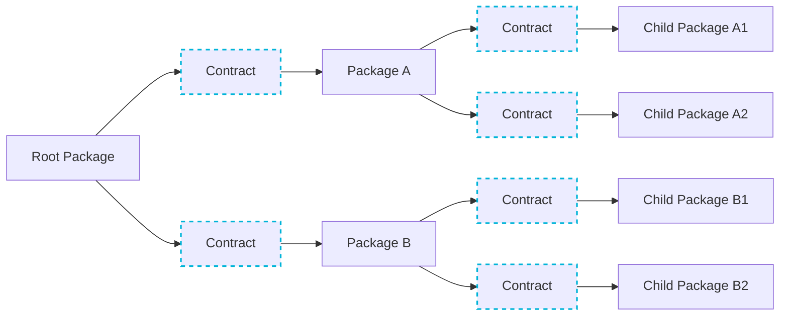
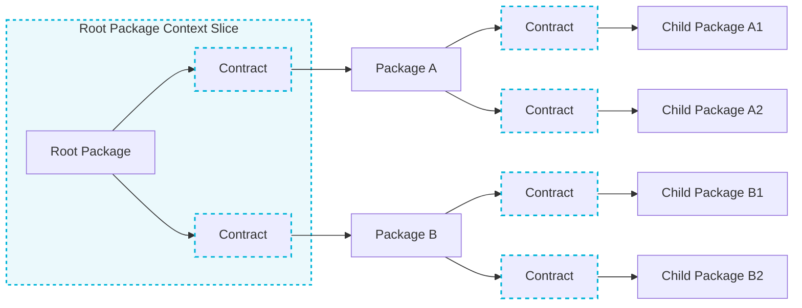
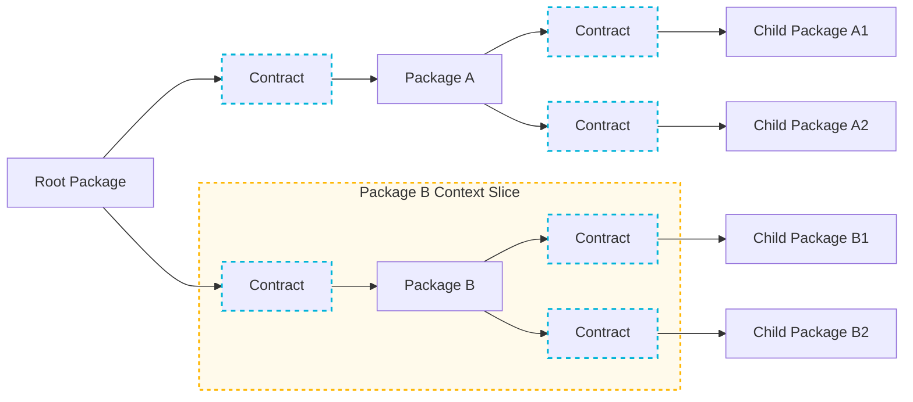
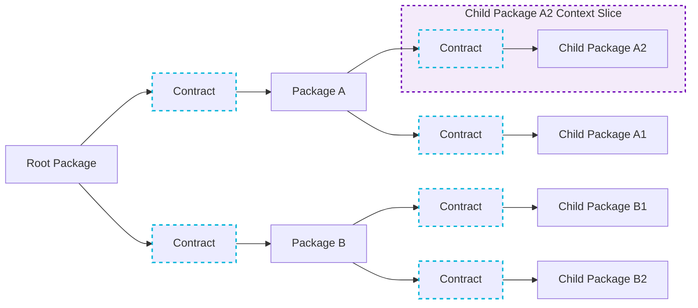
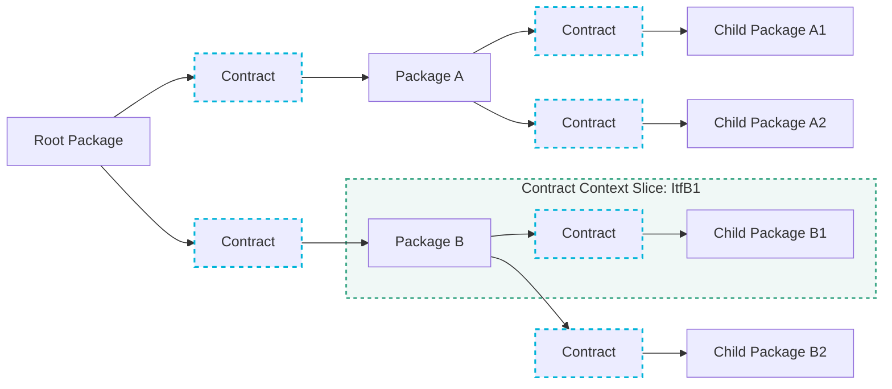
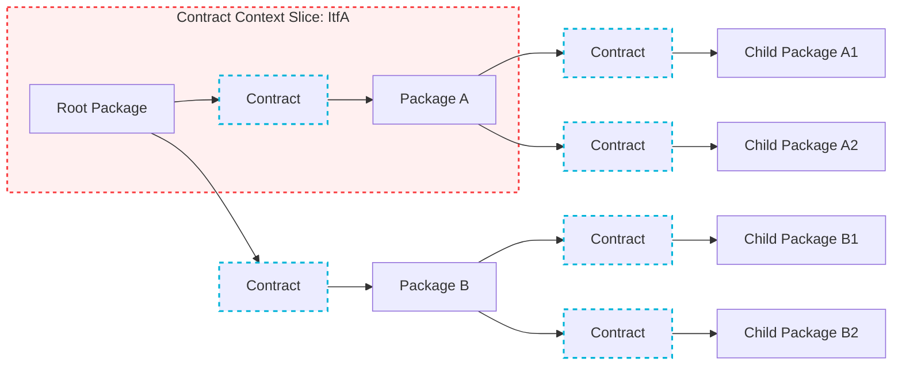

## The Fractal Context Pattern

A codebase architecture that uses consumer-driven contracts to slice LLM context by structure instead of search

Purpose: divvy up a codebase in self contained LLM contexts, information complete in some sense.

Each node and *all* its connected nodes, represent such a context.

There are two types of nodes:
    - package nodes, containing implementations
    - contract nodes, to connect the package nodes

---

Here is a repo showing packages and contract nodes. There are no llm contexts in this diagram.

---

Here we show the same repo, this time with the ctx of the root node. 

---

Package B:

---
Child package A2:

---
And anotherone:

---
and anotherone

### Notes
- chew on this. it seems clever, but is it?
- does it make implementing features easier or harder?